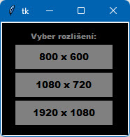
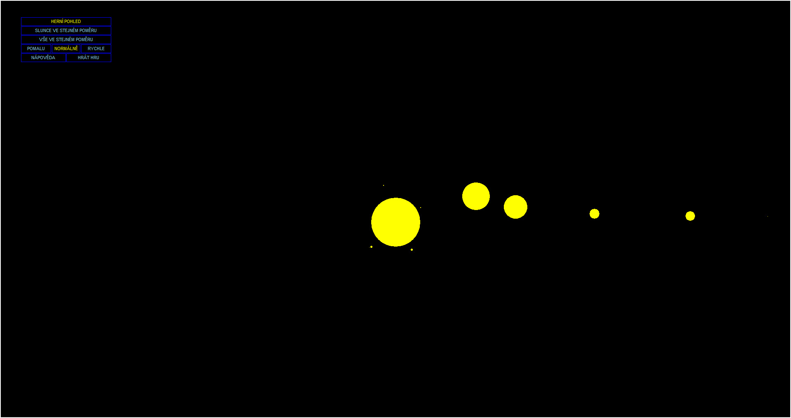
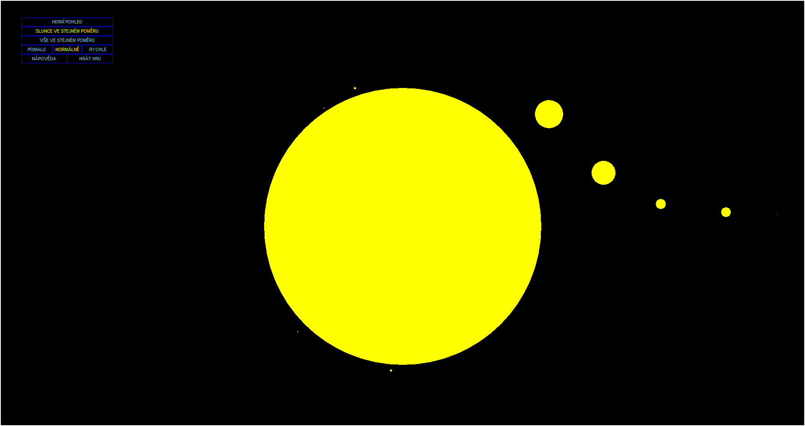
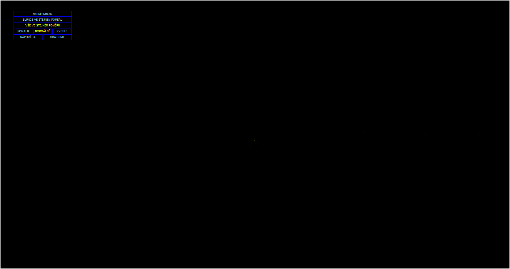
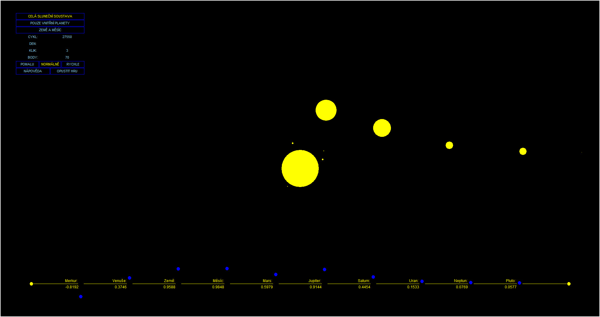
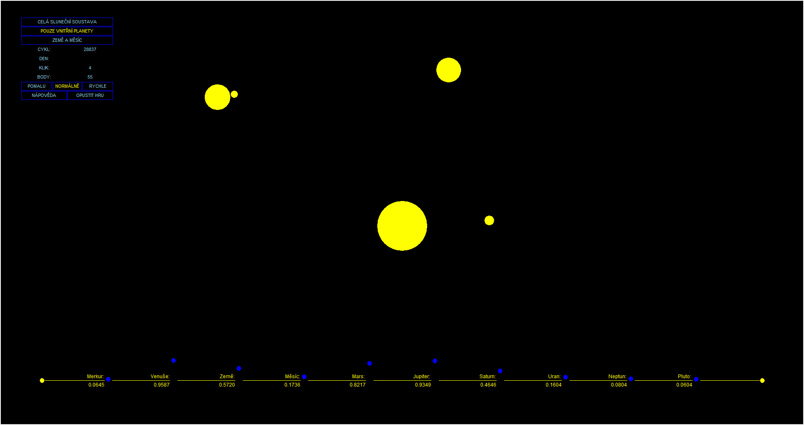
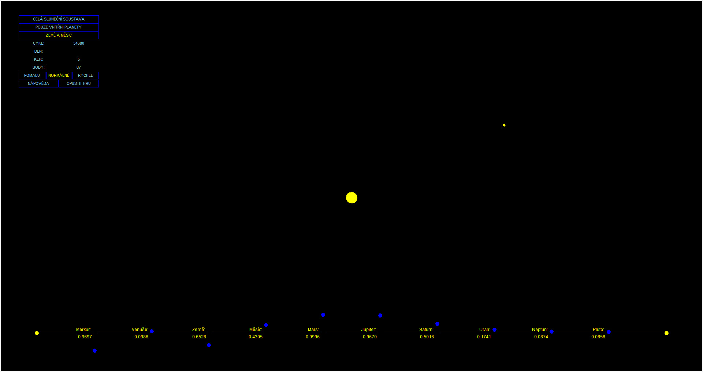

## Orbitla v0.7

[switch to English](ScreenShots/README[en].md)

Jedná se o funkční program s nekompletní herní logikou.

Program vznikl jako učební materiál sloužící k procvičení nově nabytých zkušeností a vznikal v době po probrání základů programování v jazyce Python, ale těsně před tím, než přišlo na řadu objektově orientované programování.

Program je vytvořený v Tkinteru a za pomoci funkcí modulu Math.

Počáteční myšlenkou tohoto programu bylo vytvořit model sluneční soustavy, kde by vzdálenost mezi jednotlivými tělesy a rychlost jejich oběhu byly v poměru ke skutečným hodnotám.

Hra pak měla být založena na principu, kdy po náhodném rozmístění planet v úvodu hry by šlo o to, co nejrychleji a na co nejmenší počet kliků dosáhnout toho, že všechna tělesa by byla v jedné rovině. K tomu cíli mělo dopomáhat měnění směru pohybu planet, zrychlování a zpomalování hry a také možnost přepnutí se do detailnějšího pohledu na vnitřní planety nebo jen na Zemi s Měsícem.

Program jde spustit pouhým kliknutím, takže máte-li nainstalovaný Python, můžete si ho vyzkoušet.

Hlavním důvodem pro nedokončení projektu bylo, že jsem tušil, že s příchodem objektově orientovaného programování bych ho asi psal jinak. Zároveň v době, kdy jsem ho opustil, už splnil to, co měl - procvičit dosud probranou látku - a vzhledem k tomu, že jsem chtěl pokračovat v učení, byl ponechán v tomto stavu.

Program je zde tak spíše jen z archivních důvodů, jakožto můj první projekt. Je také plně k dispozici komukoliv pro jakoukoliv další úpravu :-)

A zde je pár screenshotů:

###### Výběr rozlišení

###### Úvodní pohled se zmenšeným Sluncem vůči planetám

###### Pohled, kde Slunce má stejnou poměrovou velikost vůči planetám

###### Pohled, kde velikost Slunce odpovídá poměru modelu (planety by v tomto měřítku nebyly vidět vůbec)

###### Herní pohled na všechna tělesa

###### Herní pohled na vnitřní planety

###### Herní pohled na Zemi s Měsícem

