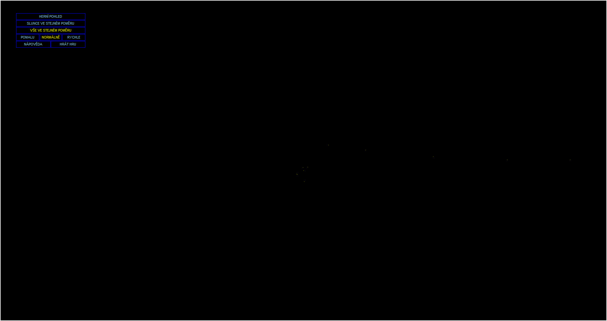
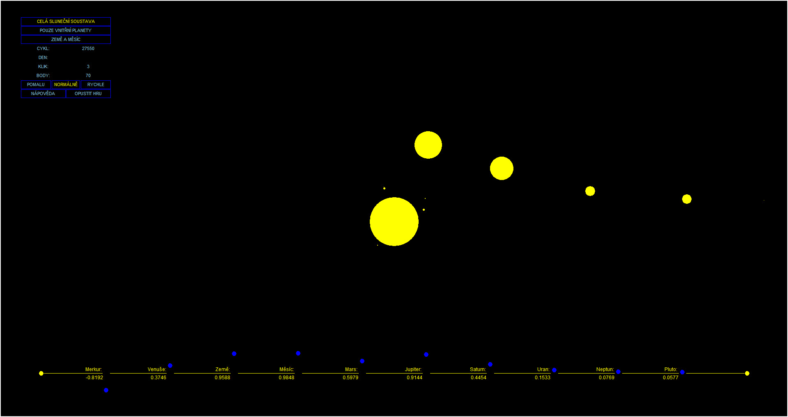
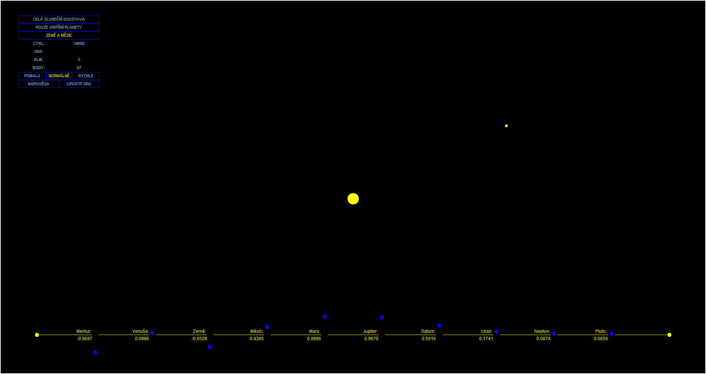

## Orbitla v0.7

[switch to Czech](../README.md)

This is a functional program with incomplete game logic.

The program was created as a learning material to practice newly acquired skills. It was developed after covering the basics of Python programming, just before object-oriented programming came into play.

The program is built using Tkinter and utilizes functions from the Math module.

The initial idea of this program was to create a model of the solar system, where the distances between celestial bodies and their orbital speeds are in proportion to real values.

The game was intended to be based on the principle that after randomly placing planets at the beginning of the game, the goal would be to quickly and with the fewest clicks align all bodies in one plane. To achieve this goal, players could change the direction of planet movement, speed up or slow down the game, and switch to a more detailed view of inner planets or just Earth with the Moon.

The program can be run with a simple click, so if you have Python installed, you can try it out.

The main reason for not completing the project was that I anticipated that with the advent of object-oriented programming, I would have written it differently. Also, by the time I abandoned it, it had fulfilled its purpose of reinforcing the material covered up to that point. Given my desire to continue learning, I left it in this state.

The program is here primarily for archival purposes, as my first project. It is fully available for anyone to modify as they see fit :-)

And here are a few screenshots:

###### Resolution selection

###### Initial view with scaled-down Sun compared to planets

###### View where the Sun has proportional size compared to planets

###### View where the Sun's size corresponds to the model ratio (planets would not be visible in this scale)

###### Gameplay view of all celestial bodies

###### Gameplay view of inner planets

###### Gameplay view of Earth with the Moon

